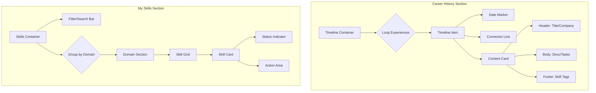

# UI/UX Audit & Redesign Specification

## 1. Executive Summary
This document outlines the UI/UX audit findings and redesign specifications for the **Career History** and **My Skills** sections of the Smart Freelance App. The goal is to enhance visual hierarchy, improve readability, and create a more polished, professional aesthetic while maintaining the existing brand identity.

## 2. Visual & UX Audit

### 2.1 General Observations
- **Strengths:**
  - Consistent use of the color palette (Terracotta/Rose gradients).
  - Clear separation of sections.
  - Interactive elements (hover states) provide feedback.
- **Weaknesses:**
  - **Visual Noise:** Heavy use of gradients on text and borders can reduce readability and feel "dated."
  - **Spacing:** Information density in cards can feel cramped; whitespace could be better utilized.
  - **Hierarchy:** Primary actions and key information sometimes lack distinct visual weight.

### 2.2 Career History (Timeline)
- **Current State:** Vertical timeline with cards connecting to a central line.
- **Issues:**
  - The "dot" positioning relative to the card can feel disconnected if the card height varies significantly.
  - "Key Responsibilities" and "Skills Used" sections can clutter the card if not collapsible or better formatted.
  - Action buttons (Edit/Delete) appearing only on hover can be problematic for touch devices (mobile/tablet).

### 2.3 My Skills (Grid)
- **Current State:** Grid of cards with skill icon, name, domain, and verification status.
- **Issues:**
  - **Repetition:** The "Unverified" badge is repetitive and draws too much attention to a negative state.
  - **Visual Weight:** The skill icon (initial) is large; the domain text is small and easy to miss.
  - **Actions:** "Verify Skill" and "Delete" buttons consume significant vertical space within the card.

---

## 3. Redesign Specifications

### 3.1 Design System Updates (Visual Tokens)

**Color Palette Refinement:**
- **Primary:** Use `$primary-500` (#E37E33) for primary actions and key accents.
- **Secondary:** Use `$primary-600` (#E23D59) for gradients and hover states.
- **Backgrounds:** Stick to `$neutral-50` for page backgrounds and `$white` for cards.
- **Text:**
  - Headings: `$neutral-900`
  - Body: `$neutral-600`
  - Meta (dates, labels): `$neutral-500`

**Typography & Layout Rules:**
- **Card Padding:** Increase internal padding to `$spacing-lg` (24px) for better breathing room.
- **Border Radius:** Standardize on `$radius-xl` (16px) for cards to match the "friendly" aesthetic.
- **Shadows:** Use `$shadow-sm` for resting state and `$shadow-md` + transform for hover state.

### 3.2 Component System

#### A. `TimelineItem` Component
- **Props:** `date`, `title`, `company`, `type`, `description`, `skills`
- **Structure:**
  - Left: Date marker (aligned with the timeline dot).
  - Right: Content Card.
- **Visuals:**
  - **Dot:** 12px circle, `$white` fill, 4px border `$primary-500`.
  - **Line:** 2px solid `$neutral-200` (subtler than current gradient).

#### B. `SkillCard` Component
- **Props:** `name`, `domain`, `status`, `level` (optional)
- **Structure:**
  - Top: Icon + Status Badge (top-right absolute).
  - Middle: Name + Domain.
  - Bottom: Action Bar (icon-only buttons or subtle text links).
- **Visuals:**
  - **Icon:** 40px circle, soft gradient background, white text.
  - **Status:** Dot indicator (Green = Verified, Gray/Yellow = Unverified) instead of full badge to reduce noise.

---

## 4. Detailed Redesign Specs

### 4.1 Career History Redesign

**Layout Strategy:**
- Move dates *outside* the card to the left side of the timeline (on desktop) for a cleaner "timeline" feel.
- Make the card strictly about the role and company.

**Card Content Hierarchy:**
1.  **Header:** Job Title (Bold, `$neutral-900`) + Company Name (Medium, `$neutral-600`).
2.  **Meta:** Employment Type (Badge: 'Full-time', 'Freelance').
3.  **Body:** Description truncated to 3 lines with "Read more" expansion.
4.  **Footer:** "Skills Used" as a horizontally scrollable chip list.

**Interactions:**
- **Edit/Delete:** Move to a "..." menu in the top-right corner of the card. Always visible but unobtrusive.

### 4.2 My Skills Redesign

**Layout Strategy:**
- Switch to a cleaner **Masonry or uniform Grid** layout.
- Group skills by **Domain** (e.g., "Frontend", "Backend") to add structure, rather than a flat list.

**Card Design:**
- **Minimalist Approach:**
  - Remove the large initial icon if it adds no value. Replace with a small color-coded dot representing the domain.
  - Focus on the **Skill Name**.
- **Verification:**
  - If verified: Show a small "Checkmark" icon next to the name.
  - If unverified: Show a subtle "Verify Now" text link at the bottom.
- **Actions:**
  - Hovering the card reveals the "Delete" trash icon in the corner.

## 5. Implementation Guide (Mermaid)



## 6. CSS/SCSS Variables Update Suggestion

```scss
// Refined Variables
$card-padding: 24px;
$card-radius: 16px;
$timeline-width: 2px;
$timeline-color: $neutral-200;
$primary-action: $primary-500;

// Text Styles
@mixin heading-style {
  font-weight: 700;
  color: $neutral-900;
  line-height: 1.3;
}

@mixin body-style {
  font-weight: 400;
  color: $neutral-600;
  line-height: 1.6;
}
```
